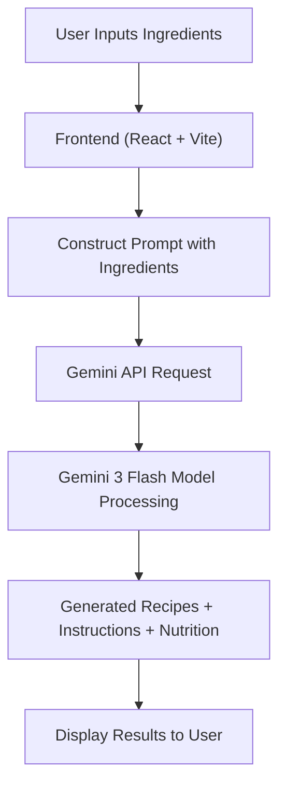

## Overview
This project is a web application designed to help students cook simple, affordable, and nutritious meals using the ingredients they already have at home, whilst also aiming to reduce food wastage. 

Students often face tight budgets and limited groceries. This app solves that by allowing users to input available ingredients and receive AI-generated meal suggestions, complete with cooking instructions and estimated 
nutritional information.

## Features
* Input available ingredients (pantry/fridge) 🥕
* AI-generated recipe suggestions 🤖
* Step-by-step cooking instructions 📋
* Basic nutritional estimates (protein, carbs, fats) 🥗
* Focus on quick and budget-friendly meals ⏱️
* Beginner-friendly recipes 💡

## How the app works (currently)

# Explanation
1. The user enters available ingredients along with quantity into the application and then chooses if they want recipes with 100% ingredient match or 1-2 ingredients missing
2. Frontend processes the input and constructs a structured prompt
3. A request is sent to the Gemini API
4. Gemini's LLM model (Gemini Flash 3) generates:
   * Recipe Suggestions
   * Step-by-step instructions
   * Estimated nutritional information
5. Results are then returned and displayed to the user

## Limitations
* Relies on external AI API (rate limits apply)
* Nutritional information is approximate, not accurate

## Future improvements
* Add a caching layer to reduce API usage and improve performance
* Integrate structured recipe/nutrition APIs for higher accuracy
* Backend layer to securely handle API keys
* Personalised meal recommendations

## Run Locally

**Prerequisites:**  Node.js

1.  Install dependencies:
   `npm install`
2. Create [.env] file in the root directory
3. Set the `GEMINI_API_KEY` in [.env] file to your Gemini API key
4. Run the app:
   `npm run dev`

## Screenshots of App

# Light mode:

# Dark mode: 

# Suggested Meals with 100% ingredient match: 

# Suggested Meals with 1-2 ingredients missing:

